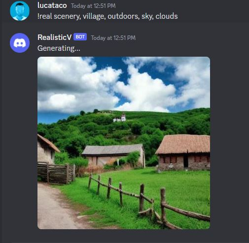

# Banana Discord Bot
This is a template to build a text-to-image Discord chat bot using a Stable Diffusion model and the Banana API. 


## Setup
Set your model's environment variables in an `.env` file

```
DISCORD_TOKEN = <YOUR_DISCORD_TOKEN>
BANANA_API_KEY = <YOUR_API_KEY>
BANANA_MODEL_KEY = <YOUR_MODEL_KEY>
```


## Run with Javascript
```
npm i
node bot.js
```


## Run with Python
```
python bot.py
```


## Run with Docker
```
docker build -t img2text .
```
Then deploy container to Cloud, ex: Google Cloud Run



